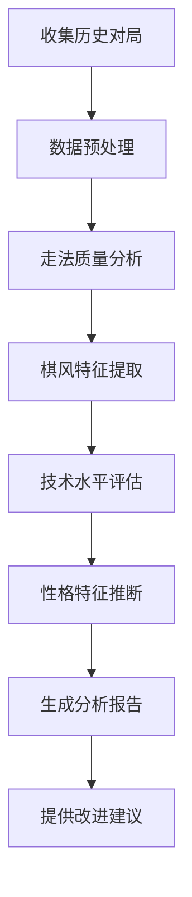

# 竞技模式个人风格分析功能说明

## 功能概述

竞技模式个人风格分析是基于用户历史对局数据的深度分析系统，能够全面评估棋手的个人风格特征、技术水平和比赛表现。通过AI智能分析，为用户提供详细的棋风报告和改进建议。

## 核心功能

### 🎯 **棋风特征分析**
- **进攻型 vs 防守型**：分析棋手的攻防偏好
- **战术型 vs 位置型**：识别棋手的下棋风格
- **稳健型 vs 冒险型**：评估风险承担能力
- **时间管理风格**：分析时间分配习惯

### 📊 **技术水平评估**
- **开局掌握程度**：分析开局知识和应用水平
- **中局战术能力**：评估战术嗅觉和执行力
- **残局技术水平**：检测残局理论和实战能力
- **位置判断能力**：分析对棋局形势的理解

### 🏆 **比赛表现统计**
- **胜率统计**：总体胜率及不同对手强度下的表现
- **对局时长分析**：平均对局时间和节奏控制
- **关键时刻表现**：优势转换和劣势翻盘能力
- **开局偏好统计**：常用开局及其成功率

## 分析维度

### 1. 棋风类型 (Playing Style)

| 风格类型 | 特征描述 | 识别指标 |
|----------|----------|----------|
| **攻击型** | 喜欢主动进攻，追求王翼攻击 | 攻击走法比例 > 60% |
| **位置型** | 注重棋子协调，长期布局 | 位置改善走法比例 > 50% |
| **战术型** | 善于发现战术机会 | 战术打击成功率 > 70% |
| **稳健型** | 偏爱稳妥下法，避免风险 | 失误率 < 15% |
| **平衡型** | 各方面发展均衡 | 无明显偏向 |

### 2. 技术强项分析

```
开局阶段 (1-10手)
├── 中心控制能力: [评分]/100
├── 棋子发展效率: [评分]/100
├── 开局理论知识: [评分]/100
└── 开局选择多样性: [评分]/100

中局阶段 (11-30手)
├── 战术执行力: [评分]/100
├── 计划制定能力: [评分]/100
├── 攻防转换: [评分]/100
└── 复杂局面处理: [评分]/100

残局阶段 (31+手)
├── 基本残局掌握: [评分]/100
├── 技术残局处理: [评分]/100
├── 王兵残局: [评分]/100
└── 时间压力下表现: [评分]/100
```

### 3. 性格特征推断

| 特征 | 表现 | 指标 |
|------|------|------|
| **决断力** | 关键时刻的选择速度 | 平均思考时间 |
| **冒险精神** | 愿意承担风险的程度 | 复杂变化选择率 |
| **抗压能力** | 劣势局面的坚持度 | 劣势翻盘成功率 |
| **学习能力** | 重复错误的频率 | 错误改正率 |

## API 接口

### 1. 获取个人风格分析

**当前用户风格分析**
```http
GET /api/user/analysis
Authorization: Bearer <token>
```

**指定用户风格分析**
```http
GET /api/user/analysis/<username>
Authorization: Bearer <token>
```

**响应示例**：
```json
{
  "success": true,
  "analysis": {
    "basic_info": {
      "username": "chess_master",
      "total_games": 45,
      "rating": 1800,
      "win_rate": 67.5,
      "analysis_timestamp": "2025-01-14T10:30:00Z"
    },
    "playing_style": {
      "primary_style": "攻击型",
      "style_confidence": 0.85,
      "style_breakdown": {
        "攻击倾向": 78,
        "位置理解": 65,
        "战术能力": 82,
        "稳健程度": 45
      }
    },
    "technical_analysis": {
      "opening_strength": {
        "score": 75,
        "analysis": "开局阶段表现良好，特别擅长1.e4开局体系"
      },
      "middlegame_strength": {
        "score": 80,
        "analysis": "中局战术嗅觉敏锐，进攻组织能力强"
      },
      "endgame_strength": {
        "score": 60,
        "analysis": "残局技术有待提高，建议加强基本残局练习"
      }
    },
    "performance_metrics": {
      "average_game_length": 35.2,
      "time_management": "良好",
      "pressure_performance": 72,
      "comeback_ability": 28
    },
    "strengths": [
      "王翼攻击组织能力强",
      "战术计算准确",
      "开局阶段发展迅速"
    ],
    "weaknesses": [
      "残局技术需要提升",
      "防守时容易失误",
      "时间管理偶有问题"
    ],
    "recommendations": [
      "重点练习基本残局",
      "加强防守技巧训练",
      "学习更多开局变化"
    ],
    "opponent_analysis": {
      "vs_higher_rated": {
        "games": 12,
        "win_rate": 25.0,
        "analysis": "面对强手时过于保守"
      },
      "vs_similar_rated": {
        "games": 20,
        "win_rate": 70.0,
        "analysis": "同水平对手中表现优秀"
      },
      "vs_lower_rated": {
        "games": 13,
        "win_rate": 92.3,
        "analysis": "对弱手把握机会能力强"
      }
    }
  },
  "timestamp": "2025-01-14T10:30:00Z"
}
```

### 2. 用户排行榜

**获取用户排行榜**
```http
GET /api/users/ranking?limit=10
Authorization: Bearer <token>
```

**响应示例**：
```json
{
  "users": [
    {
      "username": "chess_master",
      "elo_rating": 1800,
      "total_games": 45,
      "win_games": 30,
      "winning_rate": 67.5
    }
  ],
  "total": 10
}
```

## 分析算法说明

### 1. 数据收集维度

```python
# 对局基础数据
game_data = {
    "game_duration": "对局总时长",
    "move_count": "总步数",
    "result": "对局结果",
    "opponent_rating": "对手评分"
}

# 走法分析数据  
move_analysis = {
    "move_quality": "走法质量评分",
    "time_spent": "单步思考时间", 
    "position_evaluation": "局面评估",
    "tactical_opportunities": "战术机会识别"
}

# 阶段性表现
phase_performance = {
    "opening_accuracy": "开局准确性",
    "middlegame_complexity": "中局复杂度处理",
    "endgame_technique": "残局技术应用"
}
```

### 2. AI 分析流程



### 3. 评分算法

**技术评分公式**：
```
技术得分 = (正确走法数 / 总走法数) × 基础分 + 复杂局面处理加分 - 失误扣分
```

**风格识别算法**：
```python
def identify_style(move_data):
    attack_ratio = aggressive_moves / total_moves
    tactical_ratio = tactical_moves / total_moves
    solid_ratio = solid_moves / total_moves
    
    if attack_ratio > 0.6:
        return "攻击型"
    elif tactical_ratio > 0.5:
        return "战术型" 
    elif solid_ratio > 0.7:
        return "稳健型"
    else:
        return "平衡型"
```

## 使用场景

### 🎯 **个人提升**
- 了解自己的棋风特点
- 识别技术短板
- 制定针对性训练计划

### 🏆 **赛前准备**
- 分析对手风格特征
- 制定针对性战术
- 调整心理预期

### 👨‍🏫 **教学辅助**
- 教练了解学员特点
- 个性化教学方案
- 进步追踪和评估

### 📊 **数据分析**
- 棋手群体特征研究
- 风格演变趋势分析
- 训练效果评估

## 注意事项

### ⚠️ **数据要求**
- 建议至少有10局以上对局记录
- 对局质量影响分析准确性
- 定期更新分析结果

### 🔧 **使用建议**
- 结合实际棋力理性看待分析结果
- 重点关注改进建议
- 定期重新分析追踪进步

### 🔒 **隐私保护**
- 个人分析数据仅用户本人可见
- 支持匿名化数据用于研究
- 遵循数据保护法规

## 示例分析报告

### 用户：chess_master

**基本信息**
- 总对局：45局
- 胜率：67.5%
- 当前评分：1800

**风格特征**
- 主要风格：攻击型 (85%置信度)
- 攻击倾向：78分
- 战术能力：82分
- 稳健程度：45分

**技术分析**
- 开局强度：75分 - "擅长1.e4体系"
- 中局强度：80分 - "战术嗅觉敏锐"
- 残局强度：60分 - "需要加强练习"

**改进建议**
1. 重点练习基本残局定式
2. 提高防守技巧
3. 扩展开局变化知识

---

